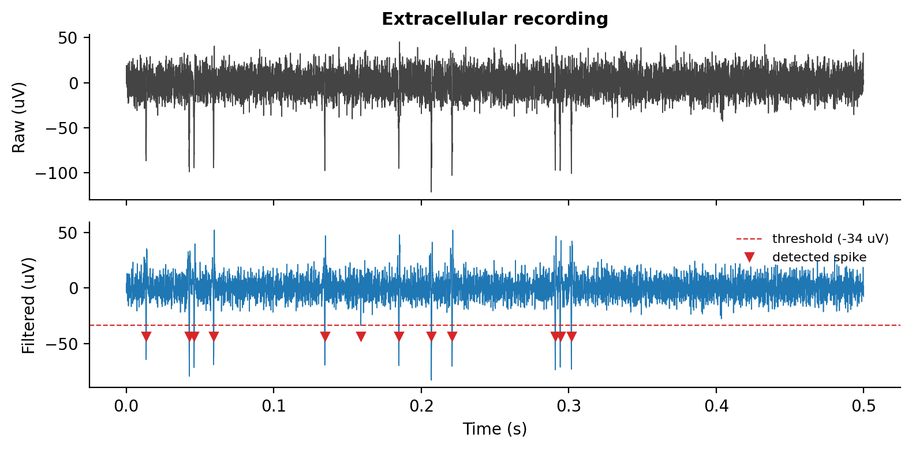
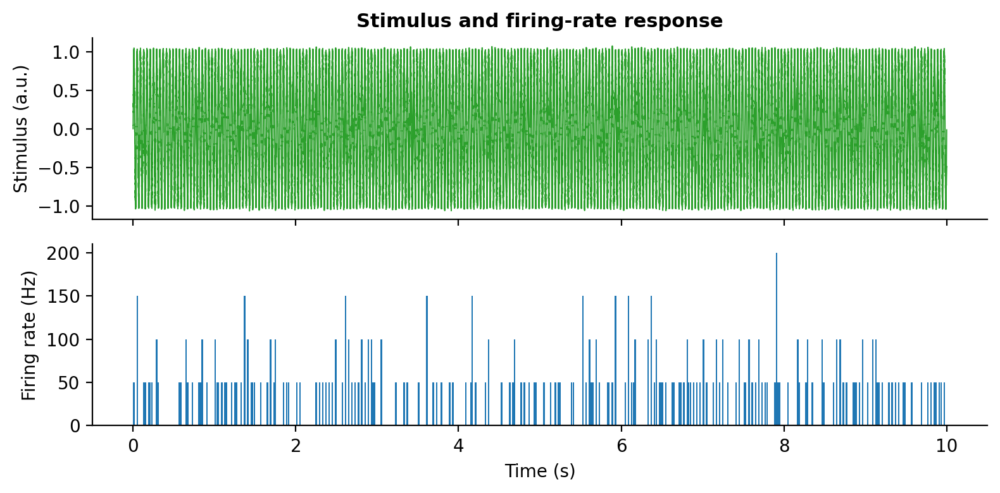
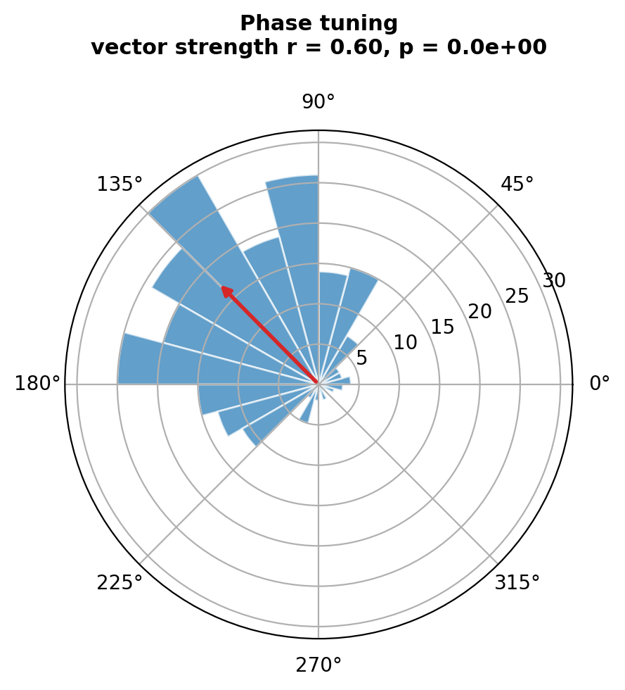
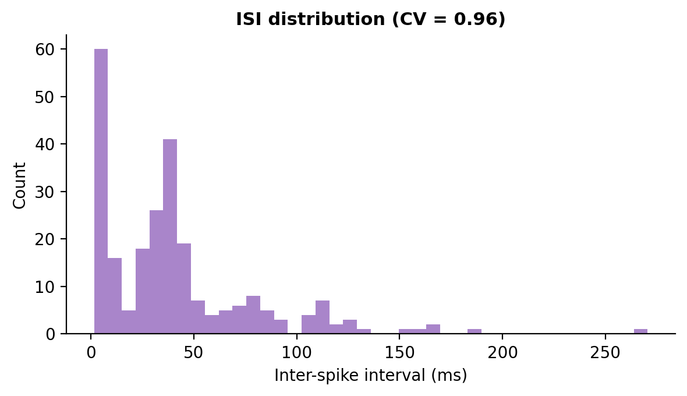

# Sensory Encoding in Extracellular Spike Trains

A small, self-contained Python pipeline for analyzing how a sensory stimulus is
encoded in the firing of a single neuron, using extracellular electrophysiology
data. It simulates a mechanosensory neuron driven by an oscillating mechanical
("wing-beat") stimulus, detects spikes, and quantifies the stimulus–response
relationship with standard systems-neuroscience read-outs.

The pipeline is written to mirror the front end of a real single-unit analysis,
so the same functions run on recorded traces — just replace the simulator with a
loader for your data format (e.g. `.abf`, Neo, or NWB).

## What it does

1. **Simulate** an extracellular voltage trace from a neuron whose firing rate is
   phase-locked to a sinusoidal stimulus (`simulate.py`).
2. **Detect spikes** — Butterworth bandpass (300–5000 Hz), a robust
   median-absolute-deviation noise threshold, and refractory-aware peak
   detection (`spike_detection.py`).
3. **Quantify encoding** — firing-rate PSTH, cycle-folded phase histogram,
   vector strength with a Rayleigh test for phase locking, and inter-spike
   interval statistics (`analysis.py`).
4. **Plot** publication-style figures (`plotting.py`).

Because the simulator has ground-truth spike times, the pipeline also reports
detection **precision / recall / F1** as a sanity check (typically F1 ≈ 0.96).

## Results

Spike detection on the raw and bandpass-filtered trace:



The stimulus and the resulting firing-rate PSTH:



Phase tuning — spikes cluster at a preferred phase of the stimulus cycle. The
red arrow is the vector-strength resultant (r ≈ 0.6, Rayleigh p ≪ 0.001),
showing significant phase locking:



Inter-spike-interval distribution:



## Quickstart

```bash
git clone https://github.com/bismasafzal-dotcom/Sensory-encoding-ephys-analysis-pipeline.git
cd Sensory-encoding-ephys-analysis-pipeline
python -m venv .venv && source .venv/bin/activate   # optional
pip install -r requirements.txt
python run_pipeline.py
```

Figures are written to a `figures/` folder when you run it. Tune the run:

```bash
python run_pipeline.py --duration 20 --stim-freq 30 --threshold-k 4.5
```

## Files

- `simulate.py` — synthetic mechanosensory recording
- `spike_detection.py` — filter, threshold, peak detection, scoring
- `analysis.py` — PSTH, phase tuning, vector strength, ISI
- `plotting.py` — publication-style figures
- `run_pipeline.py` — end-to-end demo

## Using your own data

Replace the call to `simulate.simulate_recording()` in `run_pipeline.py`
with a loader that returns a `voltage` array and its sample rate `fs`. The
detection and analysis functions take plain NumPy arrays, so nothing downstream
needs to change.

## License

MIT — see [LICENSE](LICENSE).
